# Credit Risk Analysis

## Project Overview 
Fast Lending, a peer to peer lending services company wants to use machine learning to predict credit risk. Management believes that this will provide a quicker and more reliable loan experience. Management also believes that machine learning will lead to more accurate identification of candidates for loans who will lead to lower default rates. Credit risk is an inherently unbalanced classification problem, as good loans easily outnumber risky loans. Therefore, different techniques to train and evaluate models with unbalanced classes need to be employ. Jill wants to use imbalanced-learn and scikit-learn libraries to build and evaluate models using resampling. 
The purpose of this project is to assist the lead Data Scientist to implement and evaluate several machine learning models or algorithms to predict credit risk. The credit card credit dataset from LendingClub, a peer-to-peer lending services company will be used to implement the following: 
- Oversample the data using the RandomOverSampler and SMOTE algorithms
- Undersample the data using the ClusterCentroids algorithm
- Use a combinatorial approach of over- and undersampling using the SMOTEENN algorithm. 
- Compare BalancedRandomForestClassifier and EasyEnsembleClassifier machine learning models that reduce bias to predict credit risk

## Results

### Native Random Oversampling
- Balanced accuracy score: 0.65
- Precision: 0.01
- Recall scores: 0.69(high risk), 0.61(low risk)

Balanced accuracy score
> 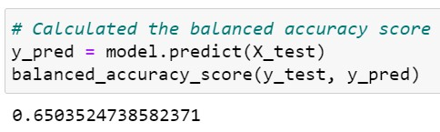

Confusion matrix
> 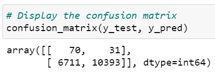

Imbalanced classification report
> 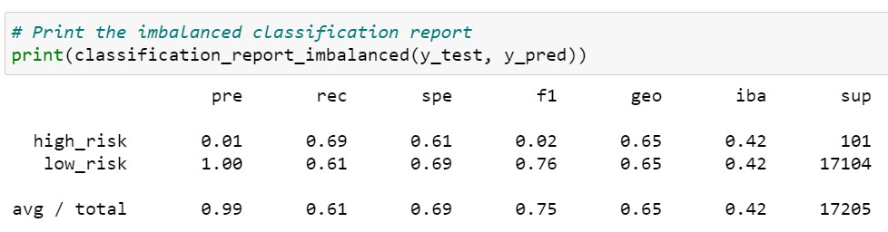

### SMOTE Oversampling
- Balanced accuracy score: 0.66
- Precision: 0.01
- Recall scores: 0.63(high risk), 0.69(low risk)

Balanced accuracy score
> 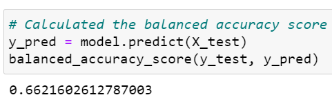

Confusion matrix
> 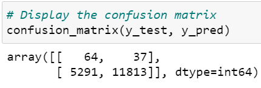

Imbalanced classification report
> 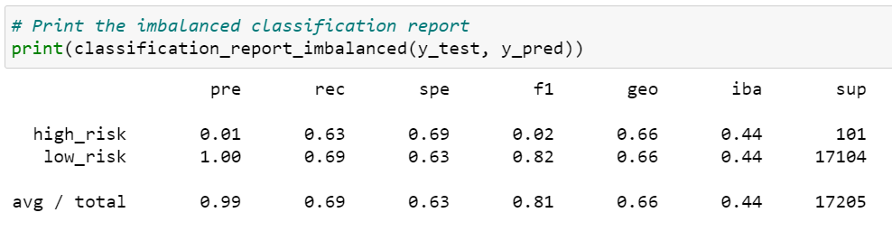

### Undersampling
- Balanced accuracy score: 0.54
- Precision: 0.01
- Recall scores: 0.67(high risk), 0.42(low risk)

Balanced accuracy score
> 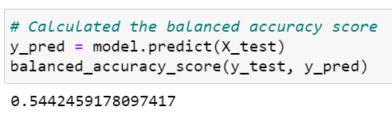

Confusion matrix
> 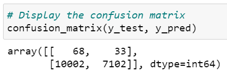

Imbalanced classification report
> 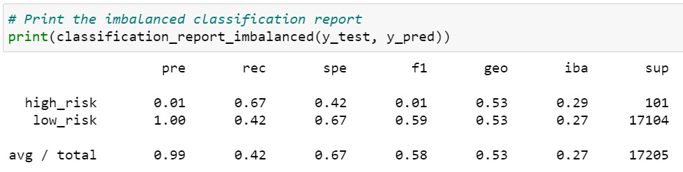

### Combination (Over and Under) Sampling
- Balanced accuracy score: 0.64
- Precision: 0.01
- Recall scores: 0.72(high risk), 0.57(low risk)

Balanced accuracy score
> 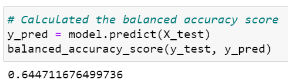

Confusion matrix
> 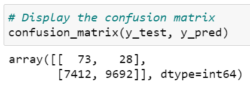

Imbalanced classification report
> 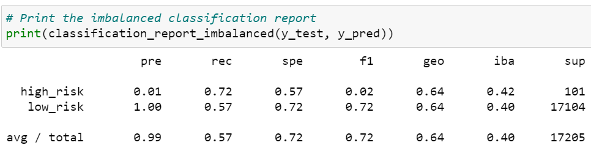

### Balanced Random Forest Classifier
- Balanced accuracy score: 0.79
- Precision: 0.03
- Recall scores: 0.70(high risk), 0.87(low risk)

Balanced accuracy score
> 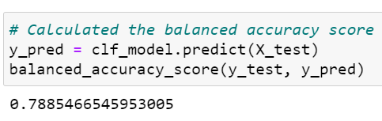

Confusion matrix
> 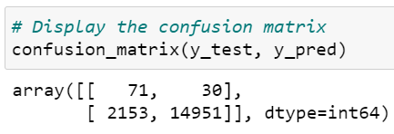

Imbalanced classification report
> 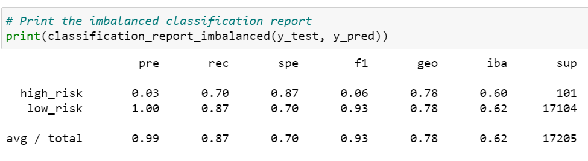

### Easy Ensemble AdaBoost Classifier
- Balanced accuracy score: 0.93
- Precision: 0.09
- Recall scores: 0.92(high risk), 0.94(low risk)

Balanced accuracy score
> 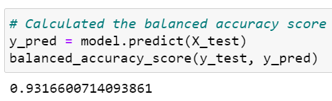

Confusion matrix
> 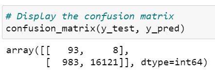

Imbalanced classification report
> 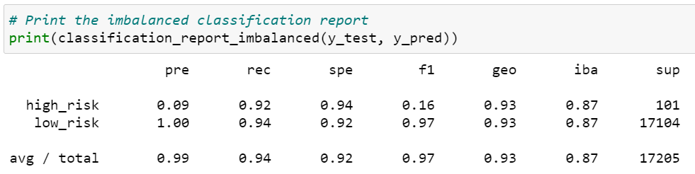

## Summary
Summary of the results: 
- Easy Ensemble AdaBoost Classifier has the highest balanced accuracy score of 0.93, and Undersampling has the lowest balanced accuracy score of 0.54.
- Easy Ensemble AdaBoost Classifier has the highest precision of 0.09, Balanced Random Forest Classifier has a precision of 0.03, and all other models have a precision of 0.01 for high credit risk. 
- Easy Ensemble AdaBoost Classifier has the highest recall scores of 0.92(high risk), 0.94(low risk), and Undersampling has the lowest recall scores of 0.67(high risk), 0.42(low risk).

> Easy Ensemble AdaBoost Classifier model is recommended to predict credit risk since the balanced accuracy score, the precision and recall scores coefficient is highest among the models. 